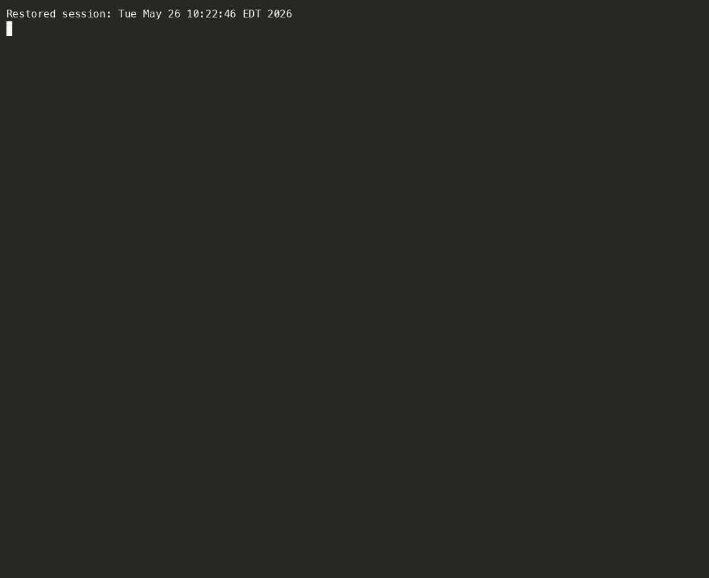
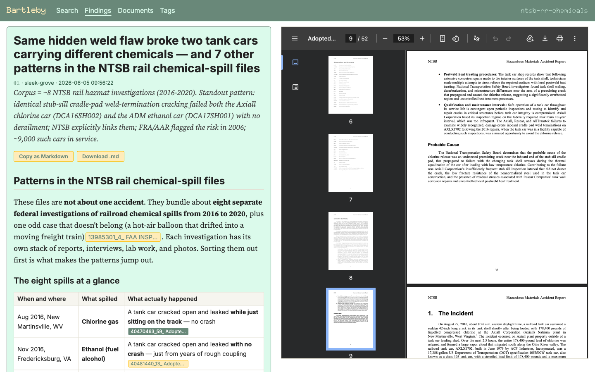

# Bartleby, the Scrivener: A Tool of Wall Street

```
 ██████╗  █████╗ ██████╗ ████████╗██╗     ███████╗██████╗ ██╗   ██╗
 ██╔══██╗██╔══██╗██╔══██╗╚══██╔══╝██║     ██╔════╝██╔══██╗╚██╗ ██╔╝
 ██████╔╝███████║██████╔╝   ██║   ██║     █████╗  ██████╔╝  ╚████╔╝
 ██╔══██╗██╔══██║██╔══██╗   ██║   ██║     ██╔══╝  ██╔══██╗   ╚██╔╝
 ██████╔╝██║  ██║██║  ██║   ██║   ███████╗███████╗██████╔╝    ██║
 ╚═════╝ ╚═╝  ╚═╝╚═╝  ╚═╝   ╚═╝   ╚══════╝╚══════╝╚═════╝     ╚═╝
```

An AI-powered tool for processing document corpora and researching them with an agentic assistant--or in other words: Bartleby is a scrivener who might prefer not to. Made with love by [John West](https://github.com/jswest), [Brian Whitton](https://github.com/noslouch), and [Rob Barry](https://github.com/robbarry).

---

## Background

At the _Wall Street Journal_, we have found it useful to let an AI agent run wild in a SQLite database containing the extracted text from a bunch of documents. Bartleby is the toolkit for that.

It's split into two pieces that share a SQLite database:

- **The `bartleby` CLI** scribes (parses, chunks, embeds, and indexes) documents. It also exposes helper commands that agents use during research sessions. Run on its own, it gives you a rich, queryable corpus regardless of whether you ever point an agent at it.
- **The `bartleby` skill** (in [`./skill`](./skill)) is a skill you drop into Claude Code, Cowork, Goose, or another compliant agent harness. It tells your agent how to explore the database, save findings, and cite evidence. The skill is BYO-model: it works with any agent the harness supports.

A SQLite database binds these two together. The CLI writes it, the skill romps through it, writing findings back into it as it cavorts.

A couple things to be aware of:

- Token costs can add up. For ingestion, summarization and image description are the drivers (you can also turn either off or use local models). For research, costs are governed by whatever model you're running the skill against. If your hardware supports it, you can run everything locally, though (see below).
- This uses the excellent (but pre-v0) [`sqlite-vec`](https://github.com/asg017/sqlite-vec) plugin for SQLite. There might be some instability there.

---

## Installation

### Prerequisites

```
brew install uv tesseract
```

(`apt install tesseract-ocr` on Debian/Ubuntu; on Windows, use the official installer from UB Mannheim.)

Tesseract is used for cheap OCR on scanned PDF pages before falling back to the more expensive VLM. The default PDF pipeline uses [pdfplumber](https://github.com/jsvine/pdfplumber) for text and [pypdfium2](https://github.com/pypdfium2-team/pypdfium2) for page rendering — both are bundled as Python deps, no system install needed. [Docling](https://docling-project.github.io/docling/) is available as an opt-in alternative PDF converter (slower, but more structurally aware) and as the default converter for HTML/MD. [sec2md](https://github.com/alphanome-ai/sec2md) is an opt-in HTML converter specialized for iXBRL EDGAR filings.

### Install Bartleby

From the project directory:

```
uv tool install .
```

This installs `bartleby` as a command-line tool in an isolated environment.

To opt into the Docling converter (slower text extraction, but layout-aware; required for HTML/MD ingestion), which is something you will almost always want, as Docling allows `.txt`, `.md`, and `.html` files to be read:

```
uv tool install '.[docling]'
```

To opt into the wsjpt provider (routes Gemini through WSJ's parsing toolkit; WSJ-internal):

```
uv tool install '.[wsjpt]'
```

To opt into [sec2md](https://github.com/alphanome-ai/sec2md) for EDGAR iXBRL filings (10-K, 10-Q, 8-K, etc.). sec2md preserves SEC table structure and section headings that Docling tends to flatten. It only activates when `html_converter = sec2md` *and* the file passes an iXBRL sniff (`xmlns:ix=...` in the head); everything else on the HTML branch still falls through to Docling.

```
uv tool install '.[sec2md]'
```

You can combine extras: `uv tool install '.[docling,sec2md,wsjpt]'`.

For development:

```
uv tool install --editable .
```

### Install the skill

The skill lives in [`./skill`](./skill). Copy it into your harness's skills directory. For Claude Code, that's typically:

```
cp -r skill ~/.claude/skills/bartleby
```

See [`./skill/README.md`](./skill/README.md) for harness-specific notes.

**Re-copy after every `git pull`.** This codebase is moving fast and the `SKILL.md` contract changes often — new flags, renamed outputs, new modes. Your harness loads `SKILL.md` from the directory you copied it to, *not* from this repo. After every pull, empty that location and re-copy so the agent sees the current contract:

```
rm -rf ~/.claude/skills/bartleby
cp -r skill ~/.claude/skills/bartleby
```

The scripts themselves resolve through the installed `bartleby` package, so a `uv tool install .` (or `--editable .` for dev) keeps those in sync.

### A note on first-run latency

The first time you run `bartleby scribe`, it will pause to download:

- the `BAAI/bge-base-en-v1.5` embedding model (~400 MB),
- the tokenizer assets that ride alongside it,
- and, if you opted into the `docling` converter, Docling's layout/OCR models on its first invocation.

These are cached under `~/.cache/` and reused on every subsequent run. The first invocation of the skill's `search` script has a similar one-time wait for the embedding model.

---

## Quick start

### 1. Configure

```
bartleby ready
```

The setup wizard asks for LLM provider/model, API keys, summary depth, temperature, and the max token threshold for reading whole documents. Settings save to `~/.bartleby/config.yaml`.



### 2. Create a project

```
bartleby project create foo
```

This creates a project directory (`foo` in this case) and marks it active. Subsequent commands use the active project unless you pass `--project`.

### 3. Ingest documents

```
bartleby scribe --files /path/to/your/docs
```

Point this at a file or directory of `.pdf`, `.html`, `.md`, `.txt`, or image files (`.jpg`, `.png`, `.webp`, `.bmp`, `.tiff`). Bartleby extracts text, chunks it, generates embeddings, and (optionally) writes a one-shot summary per document. With a vision provider configured, embedded images inside PDFs and standalone image files are also analyzed (OCR transcription + scene description) and chunked into the same searchable index. Everything goes into the project's SQLite database.

### 4. Start an agent session

In your harness of choice, load the `bartleby` skill and ask the agent a question about your corpus. The skill will guide it through searching, reading, synthesizing, and citing.

If you want the agent to ignore findings from prior sessions, start the session with the memory flag off:

```
bartleby session start --no-memory
```

(More on sessions and memory in the skill README.)

### 5. Browse what you've got

```
bartleby serve
```

Spins up a local SvelteKit UI for the active project. `/documents` shows every ingested file alongside its summary and the original PDF; `/findings` shows every saved research note with inline citation chips that jump to the cited page in the source. Safe to leave running alongside an ingest or a research session — it opens the database read-only. Requires Node.js and npm on `PATH`.

---

## Architecture

The CLI ingests. The skill researches. The database acts as the API between them. Each piece can be replaced independently as long as the schema contract holds. The database is self-describing--schema version, embedding model, and `sqlite-vec` version live in a `meta` table inside the DB itself. The skill reads `meta` on startup and refuses to run against an incompatible database.

The core tables (see [`bartleby/db/schema.py`](./bartleby/db/schema.py) for the DDL):

| Table | What lives here |
| --- | --- |
| `documents` | One row per ingested file, deduped by content hash. |
| `summaries` | One row per `document` (1:1) — title, description, body, and (optional) `authored_date`. |
| `images` | One row per *unique* image, deduped by byte hash. The same icon embedded in five docs is one row. |
| `document_images` | Join: which images appear in which document, at which page. |
| `findings` | Agent-authored research notes from `save_finding`. Each owned by a `session`. |
| `sessions` | Agent sessions, with a memory flag. |
| `chunks` | Polymorphic — one row per embeddable text chunk regardless of source. `source_kind` is one of `'document'`, `'summary'`, `'finding'`, `'image'`. |
| `chunks_fts`, `chunks_vec` | Virtual tables shadowing `chunks` for full-text (FTS5) and vector (sqlite-vec) search. One query covers all four source kinds at once. |
| `audit_logs` | One row per skill-script call, scoped to a session. |
| `tags`, `document_tags` | A controlled vocabulary the user curates, with LLM-assisted assignment. Lets the agent slice the corpus by category (`search --tag ch`, `list_documents --tag nyseg --tag conedison`). |
| `meta` | Schema version + embedding model fingerprint; the skill refuses to start against an incompatible DB. |

The `chunks` table is polymorphic on purpose: documents, summaries, findings, and images all produce searchable text, and folding them into one indexed table means one search query covers all of it. The trade-off is that `chunks.source_id` isn't a foreign key to any specific table — discipline lives in the typed insert helpers in [`bartleby/db/chunks.py`](./bartleby/db/chunks.py).

---

## Project directory structure

```
~/.bartleby/projects/<name>/
├── bartleby.db       # everything: chunks, summaries, findings, sessions, audit log, images
└── archive/          # original document files, dedup'd by content hash
    ├── <doc_hash>/<doc_hash>.<ext>
    └── images/<img_hash>.jpg   # extracted figures, scanned page renders, standalone images
```

All queryable state lives in `bartleby.db`. Findings, audit logs, and agent-generated summaries are all stored as rows there — no sidecar files, no on-disk reports.

---

## Command reference

### `bartleby ready`

Interactive configuration wizard. Asks for:

| Setting | Default | Description |
| --- | --- | --- |
| LLM provider | anthropic | `anthropic`, `openai`, or `ollama` |
| Model | varies by provider | Model name (e.g., `claude-haiku-4-5`, `gpt-5-mini`, `qwen3-vl:30b`) |
| API key | — | Required for Anthropic/OpenAI; can also use env vars |
| Summary depth | `one-shot` | `none` or `one-shot` |
| Temperature | 0 | 0 = deterministic, 1 = creative |
| Max summarize tokens | 50000 | If a document exceeds this, only the first N tokens are summarized (with a note appended) |
| PDF converter | `pdfplumber` | `pdfplumber` (fast, default) or `docling` (slower, more structurally aware) |
| HTML converter | `docling` | `docling` (default; also handles `.md`) or `sec2md` (routes iXBRL EDGAR filings to sec2md, other HTML to docling) |
| Sparse-text threshold | 100 | Pages with fewer extracted chars are treated as scanned; OCR then VLM fallback |
| Vision provider | (off) | Off by default; opt in during the wizard. If enabled, choose `anthropic`, `openai`, or `ollama` |
| Vision model | varies by provider | e.g., `claude-haiku-4-5`, `gpt-5-mini`, `qwen3-vl:30b` |
| Max image dimension | 1024 | Long-edge pixels before sending an image to the VLM |
| Tesseract min confidence | 30 | Avg confidence (0-100) below which we fall back to the VLM on sparse pages |
| Max read tokens | 50000 | Threshold above which the skill's `read_document` requires `--force` |

**API keys** can be provided in the config or via environment variables: `ANTHROPIC_API_KEY`, `OPENAI_API_KEY`, `GEMINI_API_KEY` (used by the wsjpt provider). For Ollama, configure the server URL (default `http://localhost:11434`) or set `OLLAMA_API_BASE`.

For local-only setups, see [Running fully local](#running-fully-local-for-sensitive-work) for the recommended model picks by hardware tier.

Config saves to `~/.bartleby/config.yaml`.

### `bartleby project`

Manage project workspaces. Each project gets its own database and document archive.

```
bartleby project create <name>    # Create and activate a new project
bartleby project list             # List all projects
bartleby project use <name>       # Switch active project
bartleby project info [name]      # Show project details
bartleby project delete <name>    # Delete a project and all its data (-y to skip prompt)
bartleby project upgrade <name>   # Apply additive schema upgrades to an existing DB
```

The default policy is "no backwards compat" — schema bumps mean re-ingest. The one allowed relaxation is *additive-only* upgrades (new tables, indexes, nullable columns), which ship with an entry in [`bartleby/db/upgrades.py`](./bartleby/db/upgrades.py) so existing corpora can opt in via `bartleby project upgrade <name>` instead of re-ingesting. Non-additive bumps still force a re-ingest; the upgrade command refuses them.

### `bartleby scribe`

Ingest HTML, MD, PDF, and TXT documents into the project database.

```
bartleby scribe --files <path> [options]
```

| Option | Description |
| --- | --- |
| `--files <path>` | Path to a file or directory of supported documents (required) |
| `--project <name>` | Target project (defaults to active) |
| `--model <name>` | Override LLM model for summarization |
| `--provider <name>` | Override LLM provider |
| `--pdf-converter <name>` | Override PDF converter (`pdfplumber` or `docling`) |
| `--html-converter <name>` | Override HTML converter (`docling` or `sec2md`) |
| `--verbose` | Show debug output |

**Supported file types:** `.pdf`, `.html`/`.htm`, `.md`, `.txt`, image files (`.jpg`/`.jpeg`, `.png`, `.webp`, `.bmp`, `.tiff`/`.tif`).

Ingestion runs sequentially. The embedding model is heavy, and small corpora don't benefit enough from parallelism to justify the warmup cost and complexity.

**Pipeline:**

1. Hashes and archives the source file at `archive/<hash>/<hash>.<ext>` (dedup by content).
2. Converts and chunks:
   - `.pdf`: pdfplumber by default — per-page text extraction; embedded images are extracted via page-render-crop. Pages whose extracted text is below `sparse_text_threshold` are treated as scanned: Tesseract OCR runs first (cheap), and only if confidence is below `ocr_min_confidence` does the page get routed to the VLM.
   - `.pdf` with `--pdf-converter docling`: layout-aware, structural extraction with internal OCR for image-based PDFs.
   - `.html`, `.htm`, `.md`: Docling by default (requires the `[docling]` install). With `--html-converter sec2md`, each HTML file is sniffed for the iXBRL namespace — matches route to sec2md (preserves SEC tables + section headings); non-matches still go through Docling. `.md` always goes through Docling.
   - `.txt`: read as UTF-8, simple character chunker.
   - Image files: routed directly to the VLM. OCR transcription and scene description are stored as separate chunks (`content_type='image_ocr'` and `'image_description'`).
3. Computes a `tiktoken` token count for the document.
4. Generates vector embeddings (BAAI/bge-base-en-v1.5, 768 dims).
5. Generates a one-shot, whole-document summary per document (if summary depth is `one-shot`). The summarizer enforces structured JSON output across all providers (anthropic, openai, ollama) via Pydantic. The same call also extracts an optional `authored_date` (ISO 8601) if the document states one; malformed or ambiguous dates store as NULL.
6. For documents longer than `max_summarize_tokens`, the summarizer runs on the first N tokens only and a deterministic note is appended to the saved summary.
7. Stores everything in SQLite with full-text search (FTS5) and vector search (sqlite-vec). Images dedupe at the byte level — the same icon embedded in five docs is one VLM call, not five.

_N.B._: For a sample corpus with 12 documents at 51MB total--a mix of academic, news, and regulatory PDFs--with a good number of images, it took ~2 minutes per document running with entirely local models. Shorter documents with fewer images will perform _much_ faster. Long documents with lots of images are slower. For example, a ~200-page regulatory document with lots of fine print and 23 images took ~5 minutes to embed, describe the images, and summarize. A five-page news article with a single image took ~30 seconds.

### `bartleby session`

Manage agent sessions. Sessions are first-class rows in the database; findings and audit log entries are tagged with a `session_id`.

```
bartleby session start [--no-memory]   # Start a new session, print its ID and name
bartleby session current               # Show the active session
bartleby session end                   # End the active session (cosmetic; sessions don't really "end")
```

**Most users will never run `bartleby session start`.** If no session is active when the skill calls a script, the skill auto-creates one with default settings (memory on). You only need to start a session explicitly if you want `--no-memory`.

The `--no-memory` flag creates a session that cannot read findings from prior sessions. This is enforced at the script level — the skill's `search` script returns no findings when called against a memory-off session, regardless of how the agent is prompted.

### `bartleby embed`

Embed a string and print the resulting vector as JSON. Used by the skill's `search` script during semantic search; rarely called directly.

```
bartleby embed "your query here"
```

### `bartleby logs`

View the audit log for a session. Useful when an agent does something weird and you want to see what tools it called.

```
bartleby logs [--session <name>] [--limit <n>]
```

If no session is specified, shows the most recent session's logs.

### `bartleby serve`

Launch a local SvelteKit UI for browsing the active project — findings and documents, with inline citations that link straight into the archived PDFs at the right page.

```
bartleby serve
```

Three views:

- `/` — landing page with counts for the active project.
- `/findings` — every saved finding, newest first. Click through to a split view: the finding's body (markdown, with inline citation chips) on the left, the source PDF on the right. Clicking a chip jumps the viewer to the cited page.
- `/documents` — every ingested document, alphabetized by summary title. Click through to a split view: the one-shot summary on the left, the original document on the right.



Requires Node.js and npm on `PATH`. The first invocation runs `npm install` once into `~/.bartleby/serve/`; subsequent runs skip it. The UI opens the project database read-only, so it's safe to leave running alongside an ingest or a research session — and it picks up the active project from `~/.bartleby/config.yaml`, so `bartleby project use <name>` followed by a page reload switches what you're looking at.

---

## Supported LLM providers (for ingest summarization)

| Provider | Default LLM | Default VLM | Notes |
| --- | --- | --- | --- |
| Anthropic | `claude-haiku-4-5` | `claude-haiku-4-5` | Requires API key. Structured output via tool-use. |
| OpenAI | `gpt-5-mini` | `gpt-5-mini` | Requires API key. Structured output via the SDK's Pydantic parse helper. |
| Ollama | `qwen3-vl:30b` | `qwen3-vl:30b` | Local server. Structured output via the chat API's `format=` JSON schema. One MoE model handles both jobs; `gemma4:e2b` is a lighter alternative — see the Ollama-defaults note above. |
| wsjpt | `fast` | `fast` | Optional extra (`bartleby[wsjpt]`). Routes Gemini via WSJ's [parsing toolkit](https://github.dowjones.net/data/wsjpt) so model aliases (`fast` / `smart` / `smartest`) resolve centrally — no concrete model names in bartleby config. WSJ-internal install. Set `GEMINI_API_KEY` (or `wsjpt_api_key` in config); without one, wsjpt falls back to Vertex AI via ADC. |

The same provider list is used for both ingest-time summarization (the LLM) and image analysis (the VLM). You can mix providers — e.g. OpenAI for summaries, local Ollama for image analysis — or run the same one for both. Research at the agent layer is governed by whatever model your harness is running the `bartleby` skill against, not by these settings.

## Tech stack

- **Storage:** SQLite with FTS5 (full-text) and [`sqlite-vec`](https://github.com/asg017/sqlite-vec) (vector). One file per project.
- **Embeddings:** [`BAAI/bge-base-en-v1.5`](https://huggingface.co/BAAI/bge-base-en-v1.5) via `sentence-transformers`. 768 dimensions, ~400 MB on first download.
- **PDF text + image extraction:** [pdfplumber](https://github.com/jsvine/pdfplumber) (text per page, image bounding boxes), [pypdfium2](https://github.com/pypdfium2-team/pypdfium2) (page rendering for OCR + image crops).
- **OCR:** [Tesseract](https://tesseract-ocr.github.io/) via `pytesseract`. Cheap first pass for sparse pages.
- **VLM for image analysis:** pluggable — Anthropic / OpenAI / Ollama. Schema-enforced (Pydantic) JSON across providers, like the summarizer.
- **Opt-in alternative PDF converter:** [Docling](https://docling-project.github.io/docling/) for layout-aware extraction with internal OCR. Activate via `--pdf-converter docling`. Required for HTML/MD ingest regardless of which PDF converter is selected.
- **Opt-in alternative HTML converter for SEC filings:** [sec2md](https://github.com/alphanome-ai/sec2md) (Apache 2.0) for iXBRL EDGAR filings. Activate via `--html-converter sec2md`; only routed to for files whose first 4 KB contain the iXBRL namespace marker, so a directory mixing 10-Ks with ordinary HTML still does the right thing per file.
- **Token counting:** `documents.token_count` is computed with `tiktoken`'s `cl100k_base` encoder regardless of which LLM provider you're using. A rough estimate — accurate enough for the `read_document --force` gate, not authoritative across providers.

---

## Running fully local (for sensitive work)

Bartleby is built to run end-to-end without an internet connection — the path for journalists working with sensitive material. Two pieces, both pointed at the same local Ollama:

1. **Ingest** — Run `bartleby ready`, set `provider: ollama` (and `vision_provider: ollama` if you want image analysis), and pick a model your hardware can run.
2. **Research** — Install [Goose](https://goose-docs.ai/) (Apache 2.0; originally Block's, now governed by the Linux Foundation's Agentic AI Foundation) and point it at the same local Ollama. Goose reads Anthropic's Agent Skills format from `~/.claude/skills/`, so the `cp -r skill ~/.claude/skills/bartleby` install you'd do for Claude Code works unchanged. If you have Ollama, you can run [Pi](https://pi.dev), which is also excellent with `ollama launch pi --model <model-slug>`.

No prompts, source text, or research notes leave the machine.

### Picking models for your hardware

| Hardware | Ingest (summarization and tagging) | Ingest (VLM) | Research (Goose or Pi) |
| --- | --- | --- | --- |
| 64 GB+ unified memory | `gpt-oss:120b` or `qwen3.6:35b-mlx` | `qwen3-vl:30b` | `gpt-oss:120b` or `qwen3.6:35b-mlx` |
| ~32 GB unified memory | `gpt-oss:20b` | `gemma4:e2b` (Can occasionally stall on structured-output JSON reparses, which shows up as an apparently slow run rather than an error.) | `gpt-oss:20b` |

**A note on model quality.** Local models follow tool-use protocols less reliably than frontier cloud models. Bartleby's research loop (search → read → cite → save) asks the model to track `chunk_id`s and cite them accurately; smaller models sometimes drop or hallucinate them. They can also format them incorrectly, which is super annoying. `gpt-oss:120b` is reasonably disciplined; with `gpt-oss:20b` you'll want to spot-check.

If you can't fit either tier, the middle path is **local ingest + cloud research**: keep `provider: ollama` for the deterministic ingest pipeline, but point Goose or Pi (or Claude Code) at a frontier API for the agent layer. Source documents still never leave the machine; only the agent's queries do.

---

## What's the `bartleby` skill?

A folder you drop into your agent harness that teaches the agent how to use this database. It exposes a small set of scripts (`search`, `read_document`, `save_finding`, etc.) and a `SKILL.md` that codifies an opinionated research methodology — what counts as evidence, when to read a full document vs. searching, how to cite.

See [`./skill/README.md`](./skill/README.md) for the full story.

---

## License

MIT.

---

## Anything else?

"Ah Bartleby! Ah humanity!"